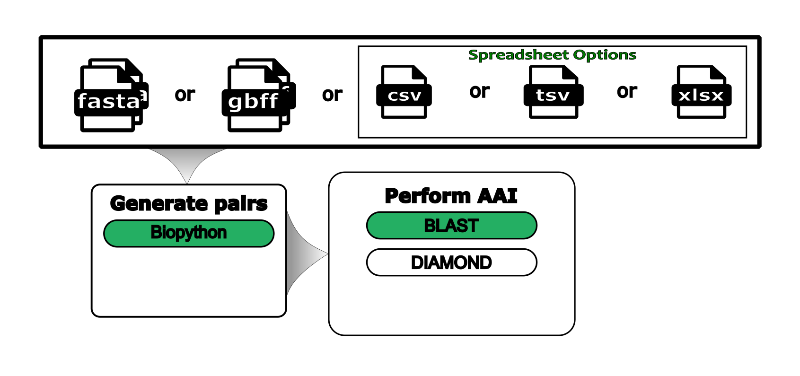

#  



> _General schematic of the steps in the workflow_

## Requirements

- [Nextflow](https://www.nextflow.io/docs/latest/getstarted.html#installation) `(>=22.04.3)`
- [Docker](https://docs.docker.com/engine/installation/) or [Singularity](https://www.sylabs.io/guides/3.0/user-guide/) `(>=3.8.0)`

## Install Worflow Locally

```
git clone https://github.com/bacterial-genomics/wf-aai.git
```

# Run Workflow

Before running workflow on new data, the workflow should be ran on the built-in test data to make sure everything is working properly. It will also download all dependencies to make subsequent runs much faster.

```
cd wf-aai/

nextflow run main.nf -profile singularity,test --outdir results
```

## Usage

### Run all inputs against each other

```
nextflow run main.nf \
  -profile singularity \
  --input INPUT_DIRECTORY \
  --outdir OUTPUT_DIRECTORY \
  --aai <blast|diamond>
```

### Run a query input against a reference directory of inputs

```
nextflow run main.nf \
  -profile singularity \
  --query QUERY_INPUT_FILE \
  --refdir REFERENCE_DIRECTORY \
  --outdir OUTPUT_DIRECTORY \
  --aai <blast|diamond>
```

### Updating maximum CPU and memory for local runs

When running locally, `--max_cpus` and `--max_memory` may need to be specified. Below, max cpus is set to 4 and max memory is set to 16 (for 16GB).

```
nextflow run main.nf \
  -profile singularity \
  --input INPUT_DIRECTORY \
  --outdir OUTPUT_DIRECTORY \
  --max_cpus 4 \
  --max_memory 16
```

### Help menu of all options:

```
nextflow run main.nf --help
```
